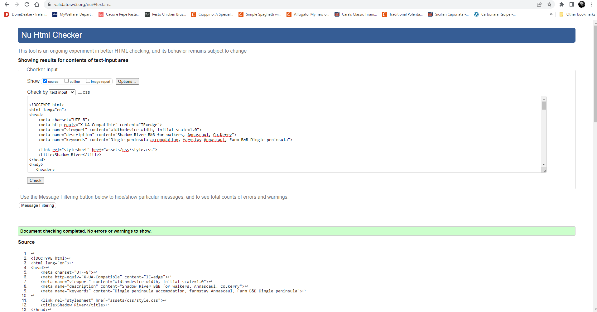
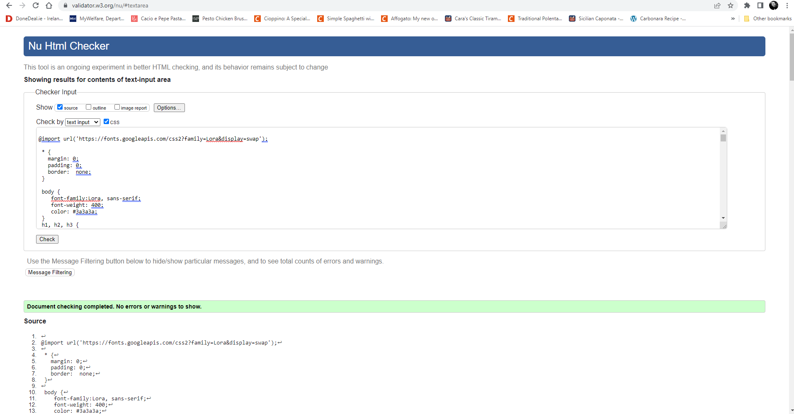

# SHADOW RIVER FARM

Here's a link to the Live project. [Here](https://tetapehta.github.io/Shadow-River-B-B/)

This is a website for an open farm and B&B in Annascaul, Co.Kerry. The website is designed to be responsive and accessible on a range of devices. It allows visitors to find out more about Shadow River and the surrounding area.

Below, you can find a link to he "Am I Responsive?" page that shows the website on different devices.

## User Experience (UX)

   ### User stories
    
      - #### Objectives for First-Time Visitors
         
        1. As a First Time Visitor, I want to easily understand the main purpose of the site and learn more about the Accommodation and Open farm.
        2. As a First Time Visitor, I want to be able to easily navigate throughout the site to find content.
        3. As a First Time Visitor, I want to look for testimonials to understand what their users think of them and see if they are trusted. I also want to locate their social media links to see their followings on social media to determine how trusted and known they are.

     -   #### Returning Visitor Objectives

        1. As a Returning Visitor, I want to book my stay.
        2. As a Returning Visitor, I want to find out more about the Cafe on the Farm.
        3. As a Returning Visitor, I want to see updates on the offer..

## Design 
     
     - #### Colour Scheme
       - Thw primary color is #rgba (58, 58, 58). Slate gray is main color used on the farm; therefore the theme flows from the real environment into the webpage. The guest easily connects the real-life color to the website presenting the farm.

     - #### Typography
       - The Lora font is the primary font used throughout the website, with Sans Serif serving as a fallback font in the event that the font is not correctly imported into the site.Lora is an elegant but readable font that ranges in size from small to large, so it is both attractive and appropriate.

     - #### Images
       - Images are important to show what the guest can expect in real life when visiting Shadow River Farm.

     - #### Wireframes
       - Balsamiq is used for wireframes. Links below.

## Features
      - Responsive on all devices

      - Ineractive elements

### Languages used

-   [HTML5](https://en.wikipedia.org/wiki/HTML5)
-   [CSS3](https://en.wikipedia.org/wiki/Cascading_Style_Sheets)

### Frameworks, Libraries and programs used

  1.  [Google Fonts:](https://fonts.google.com/)

    - Google Fonts were used to import the 'Lora' font into the style.css file, which is used on all pages throughout the project.
 
  2.  [Balsamiq:](https://balsamiq.com/)

    - Balsamiq was used to create the wireframes during the design process. 

   3. [GitHub:](https://github.com/)

    - GitHub is used to store the project's code after it is pushed from Git.

   4. [Font Awesome:](https://fontawesome.com/)

    - Font Awesome was used on landing & gallery page of the website to add icons for aesthetic and UX purposes.

## Testing

    - The W3C Markup Validator and W3C CSS Validator were used. Every page was inspected to ensure there were no syntax errors in the project.
    
 [W3 Markup Validator](https://validator.w3.org/) 

    - My CSS was showing numerous errors. 

 [W3-CSS-Validator](https://validator.w3.org/#validate_by_input) 

    - I have successfully applied all the suggested corrections.

## Furder Testing

   - Google Chrome and Mozilla browsers were used to test the website.
   - The website was viewed on a variety of devices.
   - Lighthouse was used for page performance.
   - Desktop:

    
   - Mobile:

   - Resolved contact media queries:

### Failed code: 

1. -  Media queries between 950 px and 1200 px do not apply correctly.

       FIXED CODE: Error fixed by removing padding between characters rather than inside as previously attempted. This resulted in the correct responsive media query.

2. - Gallery images not showing in the Mozzila browser.

       FIXED CODE: Error solved by transforming JPG format too WEBP format. Gallery displays correctly.

3. - Slide buttons not displaying on MAC device; Crome and Firefox browser. Screens max size 950px and down.

       FIXED CODE: Upon reviewing my commits, I discovered that I had removed CSS code that targeted Slider navigation.After
       After watching the YouTube tutorial one more time, I have successfully applied the changes.

  - Crome for Mac:
     

  - Firefox for Mac:

  - CSS Update:

4. - Form input was not applied correctly. The values of Imput were displayed incorrectly. 

   * FIXED CODE: Modified from "action" to "form dump," as advised by my mentor.changed the method from "get" to "post." Values display correctly. 

3. - Low Lighthouse performance for mobile.

   * FIXED CODE: Compress all images with TinyPing.com. Lighthouse performance improved from 75 to 89.
  

## Credits 

### Code 

 - Developer created the content.

 - A sample README.md from the Code Institute was used as a template for this document.

 - Gallery section was build following the tutorial: https://www.youtube.com/watch?v=McPdzhLRzCg

 - The contact form was borrowed from a felow SLACK student: https://roddersnz21.github.io/project-1/

### Media

- Images used on Home and Book pages were created by Eva Veber for this website..
- Images for "WINDOW INTO DINGLE PENINSULA" were created by Florian Walsh.
- Images for "TAKE YOUR MEMORIES HOME" were created by Eva Veber.

### External Links

- Social media icons link to the social media accounts of Shadow River Farm.
- Links to external websites in the gallery link to the photographers' personal websites.

### Aknowlegments 

-   My mentor, Brian Macharia, for continuous help and insightful feedback on my work during mentor sessions.

-   Tutor support at Code Institute.

-   Peer support on Slack, stand up meetings with Irene.

------

---

